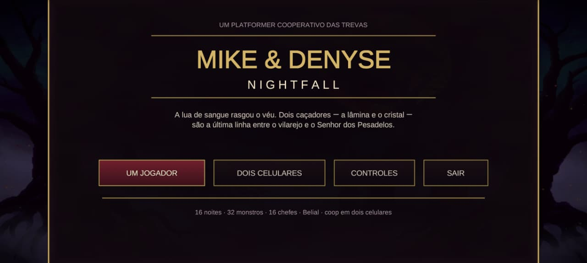
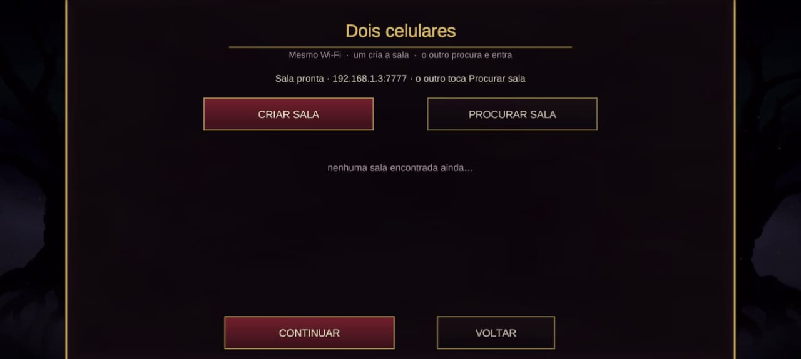
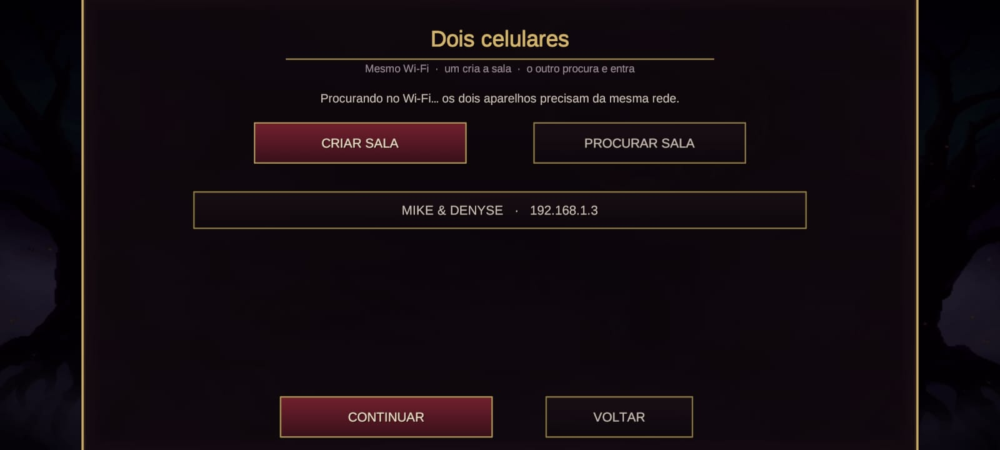
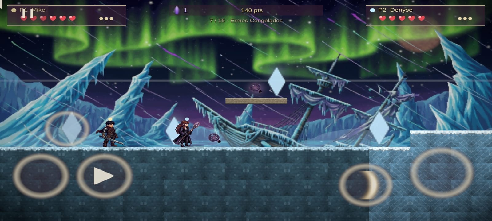
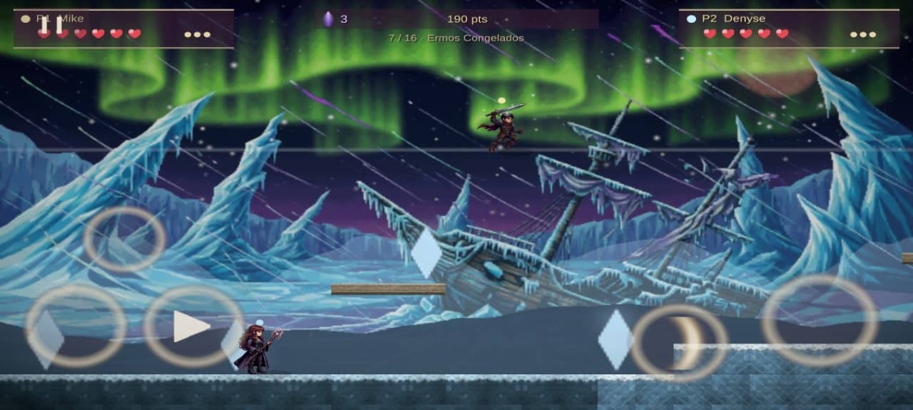

# Mike & Denyse: Nightfall

Platformer cooperativo 2D para **Android**, com 16 fases e multiplayer local entre dois celulares na mesma rede Wi‑Fi.



## O jogo

Mike e Denyse atravessam 16 noites até enfrentar Belial.

- **Mike**: corpo a corpo, mais vida e ataque pesado;
- **Denyse**: ataque à distância, maior velocidade e queda lenta;
- 16 fases;
- 32 monstros;
- 16 chefes + chefe final;
- progressão de fases;
- controles touch;
- modo solo e cooperativo.

## Stack

| Componente | Tecnologia |
| --- | --- |
| Engine | Unity 6000 |
| Linguagem | C# |
| Rede | Netcode for GameObjects + Unity Transport |
| Plataforma | Android |
| Descoberta LAN | UDP broadcast |
| Persistência | PlayerPrefs |

## Multiplayer local

Não existe servidor externo. Um aparelho atua como host e o outro como cliente.

```text
Celular A (host)               Celular B (cliente)
      │                                │
      ├── anuncia sala por UDP ───────►│
      │                                │
      └──── Unity Transport / NGO ◄────┘
```

O host executa a simulação principal e envia snapshots do estado para o segundo aparelho. A descoberta de salas utiliza broadcast UDP dentro da rede local.

| Host | Cliente |
| --- | --- |
|  |  |

| Coop no celular 1 | Coop no celular 2 |
| --- | --- |
|  |  |

## Arquitetura

O motor do jogo é majoritariamente controlado por código.

```text
NightfallUnity/Assets/Scripts/
├── NightApp.cs        # fluxo, telas, input e rede
├── GameMenu.cs        # interface
├── GameData.cs        # catálogo de heróis, inimigos e mundos
├── LevelBuilder.cs    # geração e validação das fases
├── Sim.cs             # física, combate e IA
├── WorldView.cs       # renderização
├── ArtGen.cs          # arte procedural
├── Sfx.cs             # efeitos sonoros
└── Net/
    ├── GameNet.cs
    ├── LanDiscovery.cs
    └── WifiDirectBridge.cs
```

A simulação evita depender da física automática do Unity para as regras centrais de movimento e combate.

## Validação

O projeto possui smoke tests no Editor, incluindo verificações de progressão, geração de fases e comportamento da simulação.

## Build

O projeto Unity principal está em:

```text
NightfallUnity/
```

O alvo de publicação é Android em landscape.

## Licença

Consulte o arquivo [`LICENSE`](LICENSE).

## Autor

**Maicon Nunes** — [@mikerock12](https://github.com/mikerock12)
